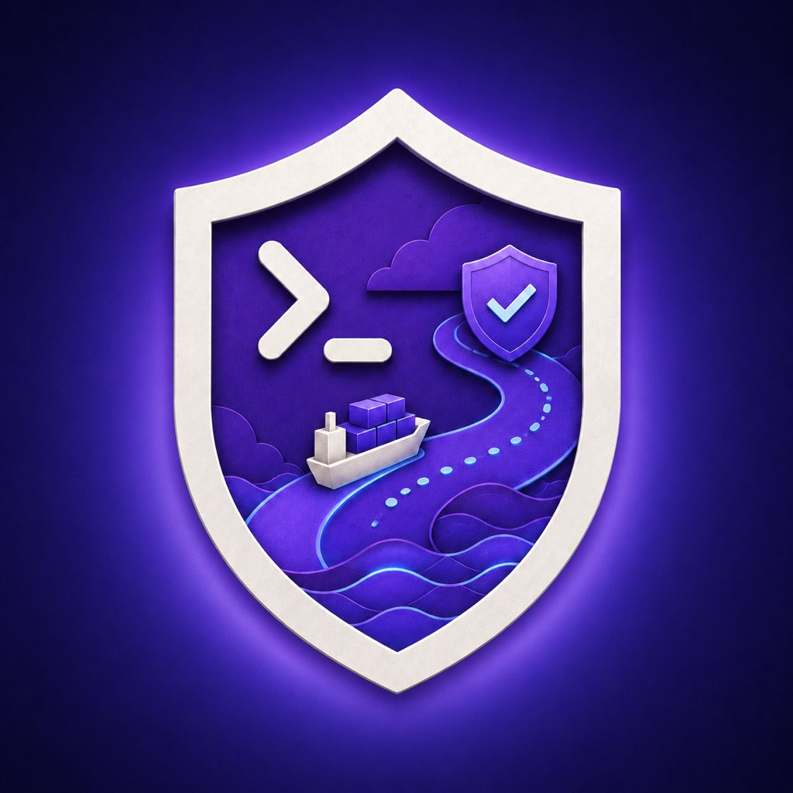

# ShipGuard

<p align="center">
  
</p>

<p align="center">
  <strong>Local-first guardrails for Codex and AI-assisted iOS maintenance.</strong>
</p>

ShipGuard is a local-first workflow kit for using Codex on production iOS apps without losing control of scope, proof, or release risk.

It gives AI-assisted development a repeatable operating loop:

- Map risky surfaces before editing: build/run/debug routes, permissions, notifications, StoreKit, widgets, App Intents, background modes, performance, design, and release proof.
- Prepare one durable task contract before Codex edits, then verify the exact diff, evidence, and claims after Codex works.
- Generate plans, specs, tasks, slash goals, and validation commands before implementation.
- Run read-only product-QA reports against real apps without turning findings into accidental app work.
- Score report quality, redact/share safely, promote public-safe fixtures, and package release evidence.

ShipGuard is not tied to any single app. This repo is the ShipGuard ShipYard: the workshop for reusable CLI commands, Codex skills, plugin metadata, fixtures, tests, and GitHub Actions for developers who want agent work to be reviewable instead of vague.

The naming style is intentional: stable commands and paths stay literal, while product surfaces get branded names like ShipGuard StarterBay, ShipGuard LaunchDeck, ShipGuard PulseRadar, ShipGuard VibeCheck, ShipGuard Tool Value Gauntlet, ShipGuard ReleaseDock, ShipGuard PluginRadar, and ShipGuard NextRail. The nitty-gritty gets call signs too: Deckhand Scripts, Gauntlet Runs, Blackbox Receipts, Bridge Notes, Engine Tapes, Cargo Crates, and Docking Gear. See `docs/shipguard-naming.md` or run `./bin/shipguard brand --strict` before adding new surfaces.

## Who This Is For

- Solo developers and small teams using Codex on production apps.
- iOS developers working near permissions, notifications, subscriptions, widgets, App Intents, performance, design, or release gates.
- Maintainers who want agents to plan, test, hand off, and prove work before shipping.

## Quick Start

Install from a release tarball, then validate the bundle:

```bash
tar -xzf shipguard-v3.113.0.tar.gz
cd shipguard-v3.113.0
PREFIX="$HOME/.local" ./scripts/install.sh
"$HOME/.local/bin/shipguard" version
./bin/shipguard validate
```

When you are inside your own app repo, use the installed command instead of `./bin/shipguard`:

```bash
shipguard ios inventory --path . --out /tmp/ios-shipguard-inventory
# or, if ~/.local/bin is not on PATH:
"$HOME/.local/bin/shipguard" ios inventory --path . --out /tmp/ios-shipguard-inventory
```

Copy a starter workflow into your app:

```bash
./bin/shipguard init ios ../my-ios-app
./bin/shipguard init web ../my-web-app
./bin/shipguard web audit --path ../my-web-app --out /tmp/shipguard-web-audit --shareable
./bin/shipguard backend audit --path ../my-service --out /tmp/shipguard-backend-audit --shareable
./bin/shipguard cli audit --path ../my-tool --out /tmp/shipguard-cli-audit --shareable
```

For a risky change, start with the proof-gated task loop:

```bash
./bin/shipguard prepare "Add provisional notification onboarding flow" --path ../my-ios-app --out /tmp/shipguard-task --profile ios --shareable
# after Codex edits
./bin/shipguard verify --task /tmp/shipguard-task/shipguard-task.json --diff /tmp/change.diff --evidence /tmp/validation.log --out /tmp/shipguard-verdict
```

1. Start each non-trivial Codex thread from `CODEX_TASK_TEMPLATE.md`.
2. Copy `AGENTS.md` into your repo root and replace the sample project names, paths, commands, and protected areas with your own.
3. Use `PLANS.md` before risky work, release work, or changes that touch persistence, notifications, payments, or app lifecycle code.
4. Pick the relevant skill under `.agents/skills/` and paste it into your Codex task context.
5. Run the narrowest validation lane that proves the change.
6. Record blockers and proof honestly before merging or shipping.

Start with these docs:

- `docs/adoption-guide.md`: first 30 minutes with ShipGuard.
- `docs/task-contract.md`: proof-gated `prepare` and `verify` loop.
- `docs/command-matrix.md`: map maintainer jobs to CLI commands.
- `docs/ios-shipguard.md`: iOS plugin, skill, and CLI workflow.
- `docs/shipguard-devspace.md`: ChatGPT visual-planning bridge from the iPhone preview.
- `docs/shipguard-naming.md`: branded naming scheme and future naming contract.
- `docs/open-source.md`: ShipGuard's native open-source operating model.
- `docs/privacy.md`: local-first privacy boundary for reports, previews, and plugin use.
- `docs/oss-evaluation.md`: how read-only app evidence becomes ShipGuard product improvements.
- `docs/security-threat-model.md`: trust boundaries for local CLI, plugin, Devspace, GitHub, and release proof.
- `docs/index.md`: full documentation map.

Common loops:

| Job | Command |
| --- | --- |
| Audit an AI coding run | `./bin/shipguard autopsy --help` |
| Prepare and verify a Codex task | `./bin/shipguard prepare --help`, `./bin/shipguard verify --help` |
| Inspect risky iOS surfaces | `./bin/shipguard ios doctor --help` |
| Check the branded naming scheme | `./bin/shipguard brand --help` |
| Audit actual ShipGuard developer value | `./bin/shipguard value-gauntlet --help` |
| First-audit a web, backend, or CLI repo | `./bin/shipguard web audit --help`, `./bin/shipguard backend audit --help`, `./bin/shipguard cli audit --help` |
| Turn profile audits into scoped work plans | `./bin/shipguard web plan --help`, `./bin/shipguard backend plan --help`, `./bin/shipguard cli plan --help` |
| Route and grade iOS build, debug, preview, and profiler proof | `./bin/shipguard ios launchdeck --help` |
| Review iOS performance evidence | `./bin/shipguard ios performance --help` |
| Review UI/UX, motion, haptics, and icon direction | `./bin/shipguard ios design --help` |
| Grade ShipGuard report usefulness | `./bin/shipguard ios report-quality --help` |
| Audit external workflow sources for native adoption | `./bin/shipguard ios external-audit --help` |
| Generate governed spec/plan/task artifacts | `./bin/shipguard ios spec-workflow --help` |
| Prepare release proof | `./bin/shipguard release-proof --help` |
| Check docs-heavy changes | `./bin/shipguard docs-check --help` |
| Create the next improvement handoff | `./bin/shipguard next-goal --help` |

Read `docs/cli.md` for the full command reference and `examples/demo-walkthrough.md` for a complete public proof path.

## What Is Inside

- `bin/shipguard`: the local CLI for validation, iOS analysis, report quality, spec workflow generation, release proof, and handoff creation.
- `scripts/task_contract.py`: the durable `prepare`/`verify` task contract and verdict engine for proof-gated Codex changes.
- `scripts/tool_value_gauntlet.py`: the ShipGuard Tool Value Gauntlet for grading every command, skill, plugin, action, doc, and proof path for real developer usefulness, running representative commands, every public command help path, skill/plugin receipts, workflow chains, scenario failure/remediation, fresh package adoption, and profile-native repair/rerun receipts before probing the weakest next workflow layer.
- `scripts/profile_audit.py`: ShipGuard WebScan, ServiceRadar, and CommandLens first-audit reports for web, backend, and CLI starter targets, with scan transparency that excludes generated ShipGuard starter files from target evidence.
- `scripts/profile_fix_plan.py`: ShipGuard WebForge, ServiceForge, and CommandForge fix-plan reports that turn profile audits into scoped tasks, validation commands, read-only validation receipts, validation rerun receipts, stop conditions, and report-quality questions.
- `plugins/ios-shipguard/`: the Codex plugin bundle for the iOS ShipGuard skill and metadata.
- `.agents/skills/`: reusable skill templates for risky app maintenance workflows.
- `templates/`: starter profiles for adapting ShipGuard into another app.
- `docs/`: product strategy, command reference, adoption guide, iOS workflow docs, Devspace docs, security model, and release-proof docs.
- `examples/` and `fixtures/`: public demo runs, benchmark fixtures, and regression cases used to prove behavior without private app code.
- `actions/`: reusable GitHub Actions for validation, report comparison, transcript checks, and release evidence.
- `evals/`: deterministic behavior checks for the ShipGuard workflow itself.

## Workflow Map

```text
request
  -> read AGENTS.md
  -> choose risk lane
  -> prepare a ShipGuard task contract
  -> write or update PLANS.md
  -> make the smallest scoped change
  -> run the narrowest proof command
  -> verify the diff, evidence, and claims
  -> ship only what is proven
```

## Why This Matters

AI coding agents are strongest when the project gives them structure: narrow scopes, explicit guardrails, real validation, and clear handoffs when proof is missing.

This repository turns those habits into public templates that developers can adapt to their own production apps without inheriting private-product assumptions.

## Current Status

This is an early public workflow kit. The focused product direction is documented in `docs/product-strategy.md`: ShipGuard should become the local policy, context, and evidence layer for high-risk Codex changes, starting with production iOS apps. The next priorities are documented in `ROADMAP.md`, and contribution guidance lives in `CONTRIBUTING.md`.

The repository is also configured as a GitHub template, so you can start from it directly and then replace the sample project profile with your own app's workflow.

## Open Source

ShipGuard is MIT licensed and built in public as a local-first developer tool. The public repo should contain the CLI, plugin metadata, skills, docs, fixtures, evals, examples, tests, and release proof needed to trust the tool without private app code.

Use `CONTRIBUTING.md` for contribution workflow, `SUPPORT.md` for issue routing, `GOVERNANCE.md` for maintainer boundaries, `CODE_OF_CONDUCT.md` for community behavior, and `SECURITY.md` for vulnerability or unsafe-disclosure handling. The native rule is: learn from mature open-source tools, but convert every idea into ShipGuard's own proof, report-quality, redaction, and local-first model.

## License

MIT. See `LICENSE`.
