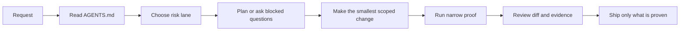

# Shipguard for Codex

Local-first Codex guardrails for solo iOS developers shipping permission-heavy apps.

This repository shares the workflow layer I use around Ringly, an iPhone alarm app where reliability, notification truth, StoreKit behavior, and release proof matter. It does not contain private Ringly source code. It contains the reusable process: a Codex plugin, iOS skill, permission/runtime inventory, agent instructions, planning templates, validation routing, release checklists, and evaluation tasks.

The existing `codex-maintainer` CLI remains the local engine. `Shipguard for Codex` is the product-facing brand for the iOS plugin, skill, preview bridge, and proof workflow.

```text
Plan before edits. Preview before guessing. Prove before claiming done.
```

## Should You Use This?

Use this toolkit if you need Codex to ask the right iOS questions before editing permission-heavy app behavior, then produce reviewable maintainer evidence: permission inventories, scoped task contracts, simulator-preview handoffs, proof routes, run autopsies, CI gates, fixture benchmarks, transcript safety, and release proof.

Skip it if you only need a small prompt template, a generic OpenAI agent framework, or a hosted dashboard. The core product is local evidence and Codex guardrails for real app maintenance.

## Who This Is For

- Solo developers using Codex or similar coding agents on production apps.
- iOS developers working near alarms, notifications, widgets, subscriptions, or release gates.
- Maintainers who want agents to plan, test, and hand off work with evidence instead of vague claims.

## What You Get

| Job | Shipguard gives you |
| --- | --- |
| Understand the app | `ios doctor` and `ios inventory` map targets, permissions, entitlements, StoreKit, privacy manifests, widgets, intents, and runtime risk. |
| Plan Codex work | `ios plan` turns inventory into blocked questions, likely owner files, proof lanes, and copy-ready Codex brief text. |
| Preview UI changes | `ios preview` serves a phone-shaped Simulator screenshot in Codex's browser and records click, right-click, and note receipts. |
| Bridge to ChatGPT Apps | `ios devspace` exposes the preview loop as a local MCP/App widget with bearer-auth options and Codex handoff tools. |
| Prevent false proof | `ios prove`, Autopsy, CI gate, release proof, transcript redaction, and fixture evals separate local evidence from manual blockers. |

## Five-Minute Demo

This path uses the public fixture and does not need private app code, Xcode credentials, a booted Simulator, or an API key.

```bash
./bin/codex-maintainer validate
./bin/codex-maintainer ios demo --out /tmp/ios-shipguard-first-run
open /tmp/ios-shipguard-first-run/README.md
```

For the smallest iOS planning loop:

```bash
./bin/codex-maintainer ios doctor --path fixtures/demo-ios-repo --out /tmp/ios-shipguard-doctor
./bin/codex-maintainer ios inventory \
  --path fixtures/demo-ios-repo \
  --doctor /tmp/ios-shipguard-doctor/ios-doctor.json \
  --out /tmp/ios-shipguard-inventory
./bin/codex-maintainer ios plan \
  --mode permission-audit \
  --inventory /tmp/ios-shipguard-inventory/ios-inventory.json \
  --out /tmp/ios-shipguard-plan/ios-plan.md
./bin/codex-maintainer ios prove \
  --plan /tmp/ios-shipguard-plan/ios-plan.json \
  --out /tmp/ios-shipguard-proof
```

For the visual loop the original feature request was aiming at:

```bash
./bin/codex-maintainer ios preview --out /tmp/ios-shipguard-preview
```

Open the printed localhost URL in Codex's in-app browser. Click or right-click the phone preview, then ask Codex to read `handoff.md` and make the smallest source edit or semantic simulator action. Raw browser coordinates are recorded as intent, not treated as proof.

## Quick Start

Install from a release tarball:

```bash
tar -xzf codex-maintainer-v3.39.0.tar.gz
cd codex-maintainer-v3.39.0
PREFIX="$HOME/.local" ./scripts/install.sh
"$HOME/.local/bin/codex-maintainer" version
```

Read next:

| Need | Start here |
| --- | --- |
| First adoption path | [`docs/adoption-guide.md`](docs/adoption-guide.md) |
| Core maintainer loop | [`docs/core-loop.md`](docs/core-loop.md) |
| iOS plugin and modes | [`docs/ios-shipguard.md`](docs/ios-shipguard.md) |
| Preview bridge | [`docs/ios-preview.md`](docs/ios-preview.md) |
| ChatGPT Apps / MCP bridge | [`docs/shipguard-devspace.md`](docs/shipguard-devspace.md) |
| Full command map | [`docs/command-matrix.md`](docs/command-matrix.md) |
| Full docs index | [`docs/index.md`](docs/index.md) |

## Common Workflows

| Job | Command or doc |
| --- | --- |
| Validate this checkout | `./bin/codex-maintainer validate` |
| Discover iOS topology | `./bin/codex-maintainer ios doctor --path fixtures/demo-ios-repo --out /tmp/ios-shipguard-doctor` |
| Build permission/runtime inventory | `./bin/codex-maintainer ios inventory --path fixtures/demo-ios-repo --out /tmp/ios-shipguard-inventory` |
| Generate a Codex plan | `./bin/codex-maintainer ios plan --mode permission-audit --inventory /tmp/ios-shipguard-inventory/ios-inventory.json --out /tmp/ios-shipguard-plan/ios-plan.md` |
| Route proof honestly | `./bin/codex-maintainer ios prove --plan /tmp/ios-shipguard-plan/ios-plan.json --out /tmp/ios-shipguard-proof` |
| Preview the app in Codex | `./bin/codex-maintainer ios preview --out /tmp/ios-shipguard-preview` |
| Match a preview click to UI targets | `./bin/codex-maintainer ios target-match --handoff <handoff.json> --snapshot <ui.json> --out <dir>` |
| Open the MCP/App bridge | `./bin/codex-maintainer ios devspace --port 8787 --preview-out /tmp/ios-shipguard-preview --bearer-token-env SHIPGUARD_DEVSPACE_TOKEN` |
| Prepare a guarded Codex handoff | `./bin/codex-maintainer ios codex-handoff --prompt-file <file> --out <dir>` |
| Audit modernization or AI work | `ios modernize`, `ios app-intelligence`, and `ios ai-readiness` |
| Redact before sharing reports | `./bin/codex-maintainer ios redact --in <file-or-dir> --out <file-or-dir>` |
| Run deterministic Shipguard evals | `./bin/codex-maintainer ios eval --cases evals/ios_shipguard_cases.jsonl --out /tmp/ios-shipguard-eval` |
| Audit agent claims | `./bin/codex-maintainer autopsy --run <run.md> --diff <diff.patch> --tests <tests.log> --out <dir>` |
| Compare maintainer benchmark runs | `./bin/codex-maintainer arena run --fixture fixtures/arena --out /tmp/arena` |
| Prove release assets | `./bin/codex-maintainer release-proof build --out /tmp/release-proof-bundle --release-url <release-url>` |
| Install the local plugin | `codex plugin marketplace add .agents/plugins` then `codex plugin add ios-shipguard@ringly-codex-workflows` |
| Adopt the workflow in another repo | `./bin/codex-maintainer init ios ../my-ios-app` or `init web/backend/cli` |

1. Start each non-trivial Codex thread from `CODEX_TASK_TEMPLATE.md`.
2. Run `codex-maintainer init <profile>` for your repo type and replace the generated placeholders with real project paths.
3. Use `PLANS.md` before risky work, release work, or changes that touch persistence, notifications, payments, or app lifecycle code.
4. Pick the relevant skill under `.agents/skills/` and paste it into your Codex task context.
5. Run the narrowest validation lane that proves the change.
6. Record blockers and proof honestly before merging or shipping.

For a worked example, read `examples/issue-to-plan-to-validation.md`.
For public proof without private app code, read `examples/demo-walkthrough.md`.
For the shortest useful adoption path, read `docs/core-loop.md`.

## What Is Inside

| Path | Purpose |
| --- | --- |
| `bin/codex-maintainer` | Dependency-light CLI for iOS Shipguard, maintainer autopsy, CI gates, arena benchmarks, transcript safety, and release proof. |
| `plugins/ios-shipguard/` | Repo-local Codex plugin with the iOS Shipguard skill and MCP sidecar configuration. |
| `.agents/skills/` | Reusable local skills for alarm testing, notification permissions, release checks, bug triage, and UI polish. |
| `scripts/` | CLI implementations for preview, Devspace MCP, inventory, planning, proof routing, redaction, evals, release proof, and report generation. |
| `actions/` | Composite GitHub Actions for validation, arena comparison, docs checks, release proof, release consumption, release diff, release evidence, and transcript verification. |
| `docs/` | Adoption guide, command reference, iOS Shipguard docs, preview/Devspace docs, release proof docs, and GitHub Pages landing page. |
| `examples/` | Copyable workflows, adoption checklists, prompt packs, review comments, demo walkthroughs, and generated public demo reports. |
| `fixtures/` | Synthetic iOS repo, autopsy cases, arena benchmark cases, external arena pack, transcript cases, and negative release-evidence fixtures. |
| `templates/` | Starter profiles for iOS, web, backend, and CLI repositories. |
| `CODEX_TASK_TEMPLATE.md`, `PLANS.md`, `SUBAGENTS.md`, `SCORECARD.md` | Human-readable contracts for starting, planning, delegating, and judging Codex work. |

## Workflow Map



## Why This Matters

AI coding agents are strongest when the project gives them structure. Ringly is my live test bed for that structure: narrow scopes, explicit guardrails, real validation, and clear handoffs when proof is missing.

This repository turns those habits into public templates that other developers can adapt without copying the private app.

## Current Status

This is an early public workflow kit. The next priorities are documented in `ROADMAP.md`, and contribution guidance lives in `CONTRIBUTING.md`.

The repository is also configured as a GitHub template, so you can start from it directly and then remove the Ringly-specific examples you do not need.

## License

MIT. See `LICENSE`.
